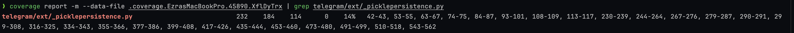
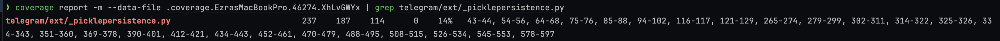
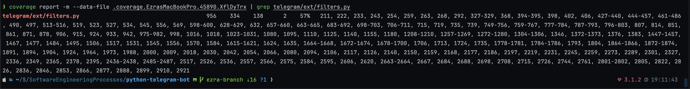
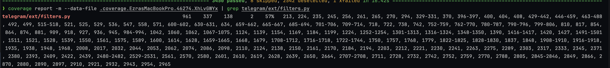

# Report for Assignment 1

## Project chosen

Name: python-telegram-bot

URL: https://github.com/python-telegram-bot/python-telegram-bot

Number of lines of code and the tool used to count it: 31621, CLOC

Programming language: Python

## Coverage measurement

### Existing tool

coverage.py

<Show the coverage results provided by the existing tool with a screenshot>

### Your own coverage tool

Ezra Berendsen

persistent_load

https://github.com/alekshere/python-telegram-bot-SEP/commit/b336ac447f4d6f49e4665ce0759243217c418e27

filter

https://github.com/alekshere/python-telegram-bot-SEP/commit/b336ac447f4d6f49e4665ce0759243217c418e27

## Coverage improvement

### Individual tests

Aleksander Szymczak

<Test 1>

<Show a patch (diff) or a link to a commit made in your forked repository that shows the new/enhanced test>

<Provide a screenshot of the old coverage results (the same as you already showed above)>

<Provide a screenshot of the new coverage results>

<State the coverage improvement with a number and elaborate on why the coverage is improved>

Ezra Berendsen

I wrote several tests, which you can find in the following commits:
- https://github.com/alekshere/python-telegram-bot-SEP/commit/b336ac447f4d6f49e4665ce0759243217c418e27
- https://github.com/alekshere/python-telegram-bot-SEP/commit/a97744d468bfc1631df7b45500c79ad8c1082f8c

persistent_load

https://github.com/alekshere/python-telegram-bot-SEP/commit/b336ac447f4d6f49e4665ce0759243217c418e27

filter

https://github.com/alekshere/python-telegram-bot-SEP/commit/b336ac447f4d6f49e4665ce0759243217c418e27

### Overall

Aleks please post screenshots here of overall coverage improvement

## Statement of individual contributions

Aleksander Szymczak:
I identified untested regions of the code, selected two functions with multiple conditional paths, instrumented these functions to measure coverage, and created test cases to cover the selected functions achieving 100% branch coverage.

Files with functions I worked on:
telegram/ext/\_handlers/conversationhandler.py
telegram/ext/\_handlers/conversationhandler.py

Files with test cases I worked on:
tests/test_message.py
tests/ext/test_conversationhandler.py

Ezra Berendsen:
I too, identified untested regions of the code, selected two functions with multiple conditional paths, instrumented these functions to measure coverage, and created test cases to cover the selected functions achieving 100% branch coverage.

Files with functions I worked on:
telegram/ext/\_picklepersistence.py
telegram/ext/filters.py

Files with test cases I worked on:
tests/ext/test_picklepersistence.py
tests/ext/test_filters.py
