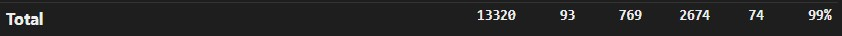
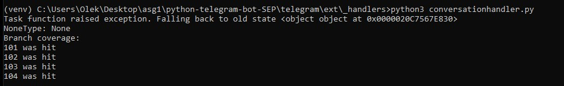
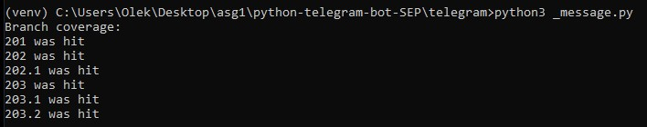
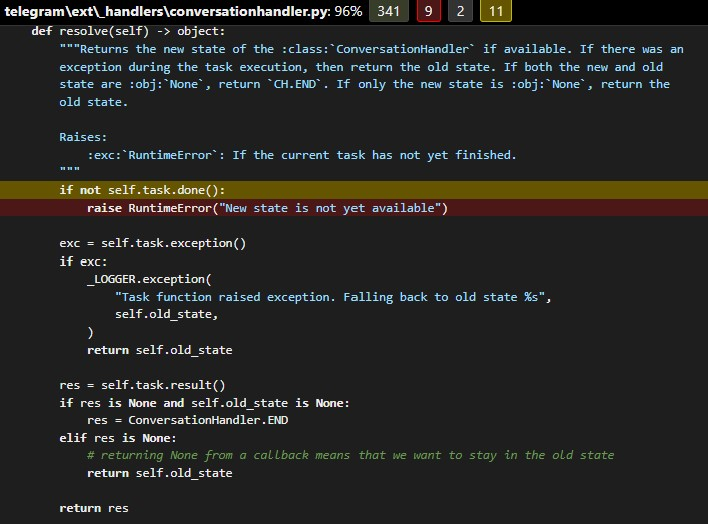
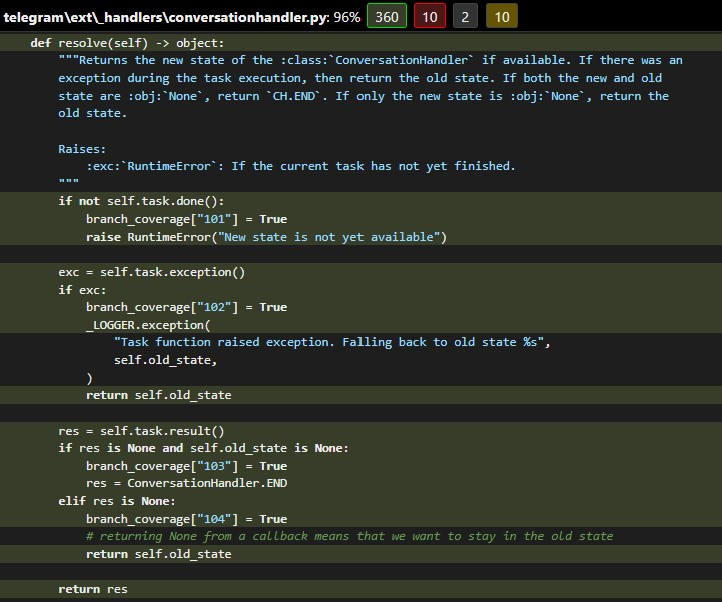
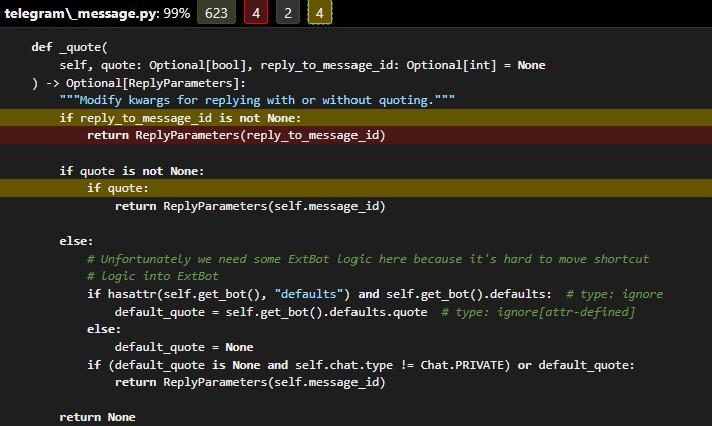
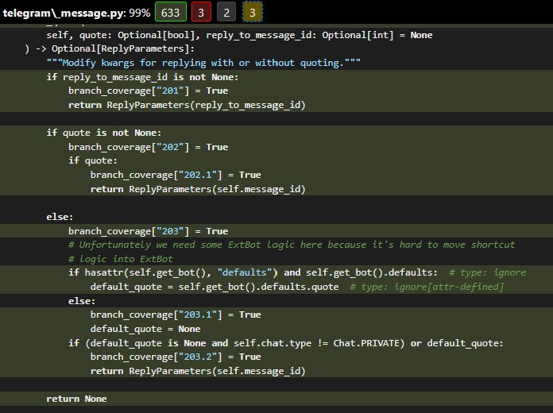

# Report for Assignment 1

## Project chosen

Name: python-telegram-bot

URL: https://github.com/python-telegram-bot/python-telegram-bot

Number of lines of code and the tool used to count it: 31621, CLOC

Programming language: Python

## Coverage measurement

### Existing tool

The tool we have used was: coverage.py. We used it by running coverage run -m pytest in the main directory of the project. The results were extracted using coverage report and coverage html for visual representation.

### Your own coverage tool

Ezra Berendsen

persistent_load

https://github.com/alekshere/python-telegram-bot-SEP/commit/b336ac447f4d6f49e4665ce0759243217c418e27

filter

https://github.com/alekshere/python-telegram-bot-SEP/commit/b336ac447f4d6f49e4665ce0759243217c418e27

Aleksander Szymczak

resolve

https://github.com/alekshere/python-telegram-bot-SEP/commit/2ae3f82b88bbac1ba2f3d6d4f829cb84b186cb1d

\_quote

https://github.com/alekshere/python-telegram-bot-SEP/commit/2b88b64e599e2fbc3242d1375d04fc81dd706fbb

## Coverage improvement

### Individual tests

Aleksander Szymczak

<Test 1> test_pending_state_not_done (conversationhandler)

https://github.com/alekshere/python-telegram-bot-SEP/commit/2ae3f82b88bbac1ba2f3d6d4f829cb84b186cb1d

Improved from 341 lines covered to 360 lines. I have created a test case which covers the uncovered lines, therefore improving the coverage result.

<Test 2> test_quote_reply_to_message_id_not_none (message)

https://github.com/alekshere/python-telegram-bot-SEP/commit/2b88b64e599e2fbc3242d1375d04fc81dd706fbb

Improved from 623 lines covered to 633 lines. I have created a test case which covers the uncovered lines, therefore improving the coverage result.

Ezra Berendsen

I wrote several tests, which you can find in the following commits:

- https://github.com/alekshere/python-telegram-bot-SEP/commit/b336ac447f4d6f49e4665ce0759243217c418e27
- https://github.com/alekshere/python-telegram-bot-SEP/commit/a97744d468bfc1631df7b45500c79ad8c1082f8c

<Test 1> for persistent_load (test_picklepersistence.py)

- test_persistent_load_random_pid_should_yield_error
- test_persistent_load_certain_pid_should_yield_none
- test_persistent_load_certain_pid_should_yield_bot

https://github.com/alekshere/python-telegram-bot-SEP/commit/b336ac447f4d6f49e4665ce0759243217c418e27

Improved lines 119-129. I improved the code by adding tests to make sure that when the function is changed in the future, the tests will fail. 
This way, we can ensure that the function is working as intended.

<Test 2> for filter (test_filters.py)

- test_filters_message_not_exists_returns_false
- test_filters_message_no_entities_returns_false
- test_filters_message_entities_returns_true
- test_filters_message_entities_not_only_start_returns_true

https://github.com/alekshere/python-telegram-bot-SEP/commit/b336ac447f4d6f49e4665ce0759243217c418e27

Improved lines 983-994. I improved the code by adding tests to make sure that when the function is changed in the future, the tests will fail.
This way, we can ensure that the function is working as intended.

### Overall

## Statement of individual contributions

Aleksander Szymczak:
I identified untested regions of the code, selected two functions with multiple conditional paths, instrumented these functions to measure coverage, and created test cases to cover the selected functions achieving 100% branch coverage.

Files with functions I worked on:
telegram/ext/\_handlers/conversationhandler.py
telegram/ext/\_handlers/conversationhandler.py

Files with test cases I worked on:
tests/test_message.py
tests/ext/test_conversationhandler.py

Ezra Berendsen:
I too, identified untested regions of the code, selected two functions with multiple conditional paths, instrumented these functions to measure coverage, and created test cases to cover the selected functions achieving 100% branch coverage.

Files with functions I worked on:
telegram/ext/\_picklepersistence.py
telegram/ext/filters.py

Files with test cases I worked on:
tests/ext/test_picklepersistence.py
tests/ext/test_filters.py
